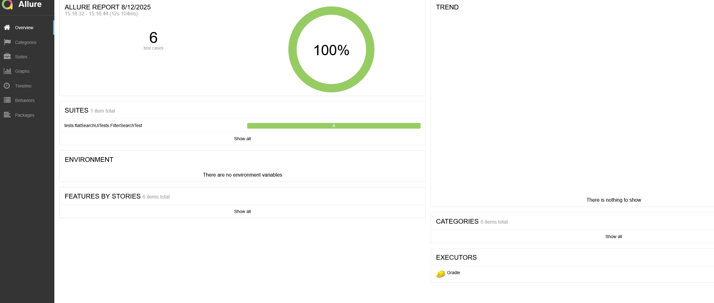
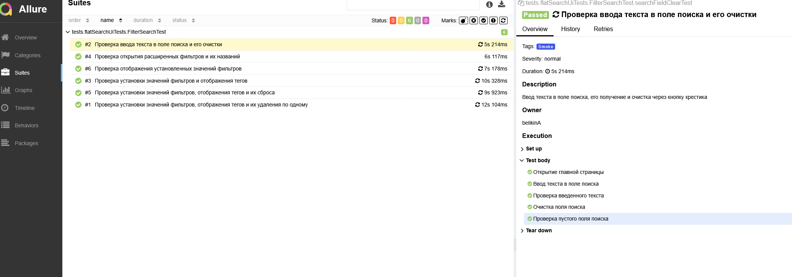
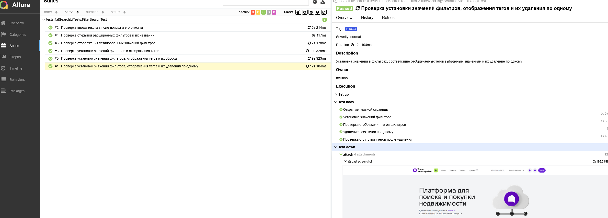

# Проект по автоматизации UI-тестов для сервиса поиска недвижимости TrendRealty

<p align="center">
  <a href="https://trendrealty.ru/" target="_blank">
    
  </a>
</p>

<p align="center">

<p align="center">
 Дипломная работа по автоматизации UI-тестирования
<p align="center">

## Содержание

* [Технологический стек](#-технологический-стек)
* [UI-тесты](#-ui-тесты)
* [Запуск тестов](#-запуск-тестов)
* [Allure-отчет](#-allure-отчет)
* [Уведомления в Telegram](#-уведомления-в-telegram)
* [Структура проекта](#-структура-проекта)
* [Конфигурация](#-конфигурация)

## 💻 Технологический стек

| [](https://www.jetbrains.com/idea/) | [](https://www.java.com) | [](https://junit.org/junit5/) | [](https://gradle.org/) |
|:---:|:---:|:---:|:---:|
| [](https://selenide.org/) | [](https://docs.qameta.io/allure/) | [](https://aerokube.com/selenoid/) | [](https://github.com/) |

* Тесты написаны на **Java** с использованием фреймворка **Selenide** в **IntelliJ IDEA**
* Сборка проекта осуществляется через **Gradle**
* UI-тестирование с использованием **JUnit 5** и **Selenide**
* Запуск тестов в удаленных Docker-контейнерах через **Selenoid**
* Генерация отчетов через **Allure Framework**
* Поддержка параллельного выполнения тестов

---

## 🌐 UI-тесты

### Основные проверки

* ✅ **Фильтрация недвижимости** - Установка значений фильтров и проверка отображения тегов
* ✅ **Расширенные фильтры** - Открытие и проверка названий расширенных фильтров
* ✅ **Сброс фильтров** - Проверка сброса всех фильтров и их удаления по одному
* ✅ **Поиск по тексту** - Ввод текста в поле поиска и его очистка
* ✅ **Отображение значений** - Проверка корректности отображения установленных значений фильтров
* ✅ **Управление тегами** - Индивидуальное удаление тегов фильтров

**Всего реализовано: 6 UI-тестов**

### Особенности реализации

* Использование **Page Object Model** для структурирования кода
* **Умные ожидания Selenide** для стабильности тестов
* Детальное логирование каждого шага теста через **Allure Steps**
* Автоматическое создание скриншотов, видео и логов браузера
* Поддержка параллельного выполнения (4 потока)
* Интеграция с **Selenoid** для удаленного запуска

---

## 🚀 Запуск тестов

### Локальный запуск

```bash
# Запуск всех UI-тестов
gradle clean test

# Запуск smoke-тестов (с тегом @Tag("Smoke"))
gradle clean test_run

# Запуск с определенным браузером
gradle clean test -Dbrowser=firefox

# Запуск с определенным размером браузера
gradle clean test -Dbrowser.size=1920x1080
```

### Удаленный запуск (Selenoid)

```bash
# Запуск в удаленном Selenoid
gradle clean test -Dselenoid_host=selenoid.autotests.cloud

# Запуск с кастомными учетными данными
gradle clean test -Dselenoid_login=user1 -Dselenoid_password=1234

# Запуск с определенным браузером в Selenoid
gradle clean test -Dbrowser=chrome -Dselenoid_host=selenoid.autotests.cloud
```

### Параметры запуска

| Параметр | Описание | Значение по умолчанию |
|----------|----------|----------------------|
| `browser` | Браузер для тестов | `chrome` |
| `browser.size` | Разрешение браузера | `2560x1440` |
| `selenoid_host` | Хост Selenoid | `selenoid.autotests.cloud` |
| `selenoid_login` | Логин для Selenoid | `user1` |
| `selenoid_password` | Пароль для Selenoid | `1234` |

---

## 📊 Allure-отчет

### Главная страница Allure-отчета



### Пример отчета о выполнении тестов



### Детальная информация о тесте



### Запуск Allure-отчета

```bash
# Генерация отчета
allure generate allure-results --clean

# Открытие отчета в браузере
allure open allure-report

# Создание ZIP-архива отчета
allure report --export allure-report.zip
```

---

## 📱 Уведомления в Telegram

### После завершения сборки, бот автоматически отправляет сообщение с результатом выполнения тестов

> **Здесь будет скриншот уведомления в Telegram**

---

## 📁 Структура проекта

```
src/test/java/
├── data/                     # Тестовые данные
├── helpers/                  # Вспомогательные классы
│   ├── Attach.java          # Прикрепление файлов к Allure
│   └── CookieManager.java   # Управление cookies
├── pages/                    # Page Object Model
│   └── FilterSearchPage.java # Страница фильтров поиска
└── tests/                    # Тестовые классы
    └── flatSearchUiTests/    # UI тесты поиска квартир
        ├── TestBase.java     # Базовый класс для тестов
        └── FilterSearchTest.java # Основной класс с UI-тестами
```

## 🔧 Конфигурация

Проект настроен для работы с веб-приложением TrendRealty:

* **Base URL**: `https://trendrealty.ru/`
* **Таймаут ожидания**: 10 секунд
* **Интервал проверки**: 200мс
* **Параллельность**: 4 потока
* **Поддержка VNC и видео**: Да


---


## 📈 Метрики качества

* **Покрытие тестами**: Основные пользовательские сценарии
* **Стабильность**: Использование умных ожиданий Selenide
* **Производительность**: Параллельное выполнение тестов
* **Отчетность**: Детальные Allure-отчеты с медиа-файлами

---

## 📝 Автор

**Дипломная работа** - Автоматизация UI-тестирования  
**Студент**: [Артем Б.]  
**Поток**: [35]  
**Год**: 2025

---

## 🔗 Полезные ссылки

* [Selenide Documentation](https://selenide.org/)
* [Allure Framework](https://docs.qameta.io/allure/)
* [JUnit 5 User Guide](https://junit.org/junit5/docs/current/user-guide/)
* [Gradle User Manual](https://docs.gradle.org/current/userguide/userguide.html)
* [Selenoid Documentation](https://aerokube.com/selenoid/latest/)
